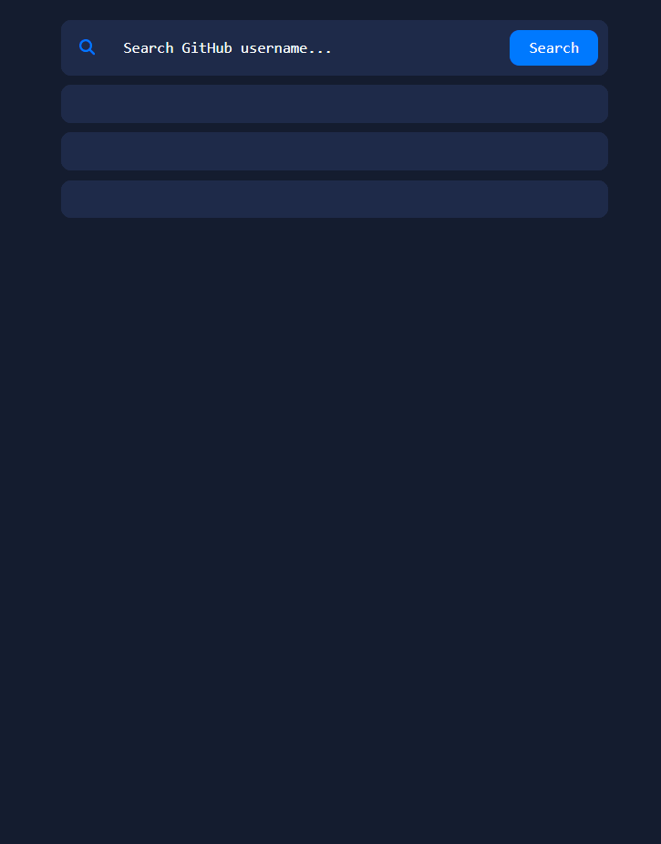

<h1 align = "center"> GitHub API Search </h1>

 

## 💻 About the Project

This is a project where I used the GitHub API to get the GitHub users data and display them on the screen. Showing name, image, repositories and more.

### Sections

The project includes the following three sections:

- #### 🧑 Profile section

  The profile section it's the place where includes the following datas:

  - User's image;
  - User's name;
  - User's User Name;
  - User's following;
  - User's followers;

- #### 📚 Repositories Section

  The repository section contains the last 10 repositories that the user recently created.

- #### 🧾 Events Section

  The events section contains the last 10 events tha the user recently created.

 

### 📱 Responsive

The project is fully responsive the for most screen devices.

 
 

<h3 align = 'center'><a href = 'https://jhowbrcg.github.io/newsletter-sign-up-form/'>See the project</a></h3>

 

## Creator

| Author                                                                                                                                      |
| ------------------------------------------------------------------------------------------------------------------------------------------- |
| <a target="_blank" href="https://github.com/JhowBRCG"> </a> |
| &nbsp; &nbsp; &nbsp; Jhonathan                                                                                                              |

